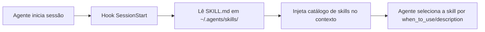

# AGENTS.md

## Missão

**agents-skills** — Coleção de skills (e hooks de sessão) para agentes de IA, seguindo a especificação Agent Skills (agentskills.io) e princípios de harness engineering. Compatível com Devin, Claude Code, Cursor, Windsurf, VS Code/Copilot, Gemini CLI e Google Antigravity.

## Stack Tecnológica

| Camada | Tecnologia | Versão |
|--------|-----------|--------|
| Scripts | Shell (Bash) | 5.x |
| Documentação | Markdown + YAML | — |
| MCP | Model Context Protocol | — |
| Lint | ShellCheck | — |
| Licença | MIT | — |

## Estrutura do Projeto

```
agents-skills/
├── skills/           # Agent Skills (SKILL.md format)
├── hooks/            # Session-start hooks por IDE (devin/claude/cursor/windsurf/vscode/gemini)
├── workflows/        # Workflows agênticos para automação
├── .agents/          # Infraestrutura de agentes (harness)
│   ├── CONTEXT.md    # Estratégias de carregamento de contexto
│   ├── RULES.md      # Guardrails (hard/soft rules do harness)
│   ├── MEMORY.md     # Estado cross-session
│   ├── TOOLS.md      # Ferramentas e MCP
│   ├── WORKFLOWS.md  # Automação
│   └── README.md     # Documentação do harness
├── install.sh        # Instalador (--all, --devin, --claude, --cursor, ...)
├── clear-up-linux.sh # Utilitário de limpeza de sistema
├── git-cleanup-repos.sh # Otimização de repositórios git
└── llms.txt          # Discoverability para LLMs
```

> Este repositório distribui **apenas skills + hooks**. Não há pasta `rules/` nem `knowledge/`.

## Como o agente carrega o catálogo



## Caminhos por Plataforma

| Plataforma | Config Principal | Skills | Hooks |
|-----------|-----------------|--------|-------|
| Base (todas) | `AGENTS.md` | `~/.agents/skills/` | — |
| Devin | `AGENTS.md` | `~/.devin/skills/`, `~/.config/devin/skills/` | `~/.devin/hooks/` |
| Claude Code | `CLAUDE.md` | `~/.claude/skills/` | `~/.claude/hooks/` |
| Cursor | `AGENTS.md` | `~/.cursor/skills/` | `~/.cursor/hooks/` |
| Windsurf | `AGENTS.md` | `~/.windsurf/skills/` | `~/.windsurf/hooks/` |
| VS Code / Copilot | `AGENTS.md` | `~/.github/skills/` | `~/.github/hooks/` |
| Gemini CLI | `AGENTS.md` | `~/.gemini/skills/` | `~/.gemini/hooks/` |
| Google Antigravity IDE | `AGENTS.md` | `~/.gemini/skills/` | `~/.gemini/hooks/` |
| Google Antigravity CLI (agy) | `AGENTS.md` | `~/.gemini/antigravity-cli/skills/` | `~/.gemini/antigravity-cli/hooks/` |

## Comandos

```bash
# Instalar para todos os IDEs/CLIs (skills + hooks + AGENTS.md)
./install.sh --all

# Instalar para ferramenta específica
./install.sh --devin
./install.sh --claude
./install.sh --antigravity
./install.sh --agy

# Pré-visualizar sem alterar nada
./install.sh --devin --dry-run

# Lint dos scripts
shellcheck install.sh rm-backup.sh git-cleanup-repos.sh clear-up-linux.sh

# Validar instalação
test -d ~/.agents/skills && test -f ~/.devin/AGENTS.md && echo "PASS" || echo "FAIL"
```

## Padrões de Código

### DO (Faça)
- Skills devem ter `SKILL.md` com YAML frontmatter (`name`, `description`)
- Nomes de pasta: lowercase kebab-case, máx 64 chars
- `name` no frontmatter == nome da pasta da skill
- Scripts shell devem passar no ShellCheck
- Documentação clara e objetiva

### DON'T (Não Faça)
- Não criar skills sem `SKILL.md`
- Não duplicar conteúdo entre AGENTS.md e arquivos referenciados
- Não assumir plataforma específica em skills genéricas
- Não commitar secrets
- Não criar assets > 5MB por skill

## Hard Rules

1. **SKILL.md obrigatório**: toda skill deve ter SKILL.md válido
2. **Naming convention**: folder name == `name` no frontmatter
3. **Secrets**: nunca commitar `.env`, tokens ou credenciais
4. **Forward-only deps**: sem dependências circulares entre skills
5. **AGENTS.md como index**: máx 500 linhas, referenciar não duplicar

## Soft Rules

1. Adicionar nova skill → seguir padrão existente (veja `writing-skills`)
2. Modificar `install.sh` → testar com `--all` (e `--dry-run`)
3. Scripts de cleanup → sempre oferecer `--dry-run`

## Agent Loop

> Padrão: **ReAct** (Observe → Think → Act → Verify)

```
1. Receber tarefa
2. Carregar AGENTS.md
3. Identificar skill(s) relevante(s)
4. Implementar alteração
5. Executar lint: shellcheck
6. Validar instalação: ./install.sh --devin --dry-run
7. Criar PR
```

## Response Style

- Idioma: Inglês para código e docs do repositório
- Conciso e direto
- Commits: `feat:`, `fix:`, `docs:`, `refactor:`

## Core Principles

**Humans direct. Agents execute.**

- AGENTS.md como index (~100 linhas), não enciclopédia
- Arquitetura rígida com dependências forward-only
- Garbage collection contínuo para débito técnico

## Referências

- `.agents/CONTEXT.md` — Estratégias de context engineering
- `.agents/RULES.md` — Guardrails do harness
- `.agents/TOOLS.md` — Ferramentas e MCP
- `.agents/WORKFLOWS.md` — Automação
- `.agents/MEMORY.md` — Estado cross-session
- [Agent Skills Specification](https://agentskills.io)
- [Model Context Protocol](https://modelcontextprotocol.io)
