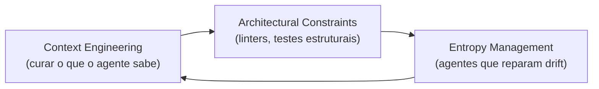
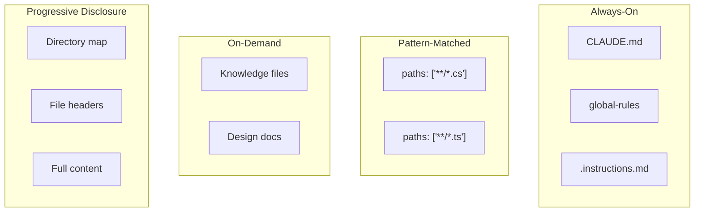
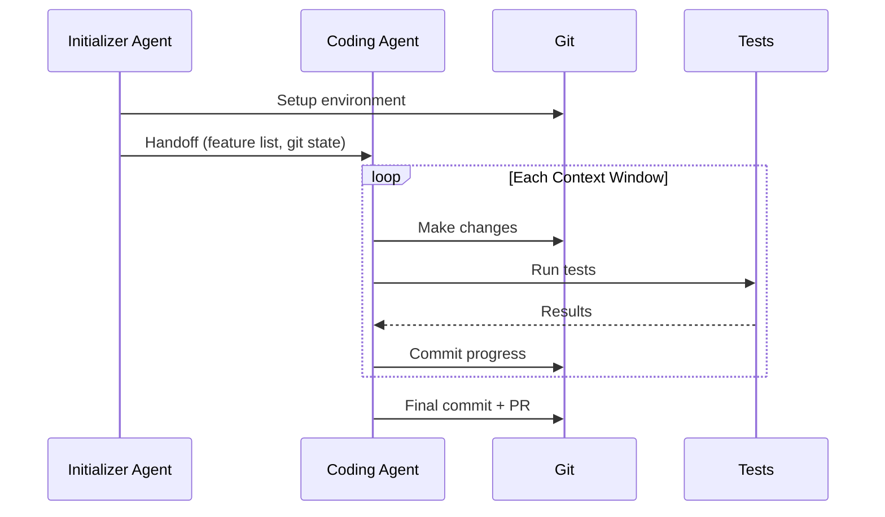
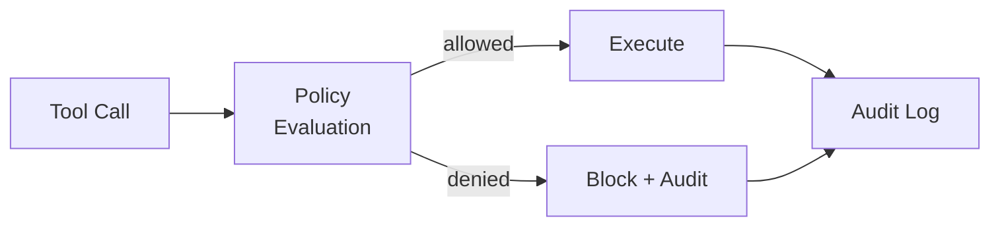

# Harness Engineering Patterns

## Visao Geral

Harness engineering e a disciplina de projetar o scaffolding — entrega de contexto, interfaces de ferramentas, artefatos de planejamento, loops de verificacao, sistemas de memoria e sandboxes — que envolve um agente de IA e determina se ele tem sucesso ou falha em tarefas reais.

## Fundamentos

### Tres Sistemas Interligados (Martin Fowler)

- **Context engineering**: Curar o que o agente sabe (feedforward guides + feedback sensors)
- **Architectural constraints**: Controles deterministicos (linters, testes estruturais)
- **Entropy management**: Agentes periodicos que reparam drift de documentacao

### Humans on the Loop (nao In the Loop)

Harness engineers projetam e mantem ambientes de agentes em vez de inspecionar outputs individuais.

## Design Primitives

### Agent Loop

O padrao ReAct (Observe → Think → Act → Verify) e a base de virtualmente todos os harnesses. Variacoes:

| Padrao | Descricao | Caso de Uso |
|--------|-----------|-------------|
| **ReAct** | Observe-Think-Act-Verify loop | Tarefas simples, passo a passo |
| **Plan-and-Execute** | Planner separa do executor | Tarefas de longo horizonte |
| **Reasoning Sandwich** | Deep thinking em planejamento e verificacao | Tarefas complexas com verificacao critica |
| **State Machine** | Transicoes explicitas entre estados | Workflows deterministicos |
| **Graph/Flow** | DAG de tarefas com dependencias | Multi-agent orchestration |

### Context Delivery

Quatro padroes de entrega de contexto para agentes:

### Harnessability

Harnessability deve ser criterio de primeira classe em decisoes de tecnologia e arquitetura:

- Quanto uma tecnologia e amigavel para agentes?
- A arquitetura permite verificacao automatizada?
- Os padroes sao mecanicamente validaveis?

## Patterns de Producao

### Long-Running Agent Sessions (Anthropic)

- Initializer agent configura ambiente uma vez
- Coding agent faz progresso incremental por sessao
- Handoff estruturado: feature lists, git commits, test gates

### Multi-Agent Coordination (Anthropic — C Compiler)

- 16 instancias Claude em paralelo no mesmo repo git
- Agentes claimam tarefas via arquivos em `current_tasks/`
- Git forca resolucao natural de colisoes
- Loop de restart continuo spawna sessoes frescas
- Feedback de testes filtra para poucas linhas de resumo

### Azure SRE Agent (Microsoft)

- Expor tudo como arquivos: codigo, runbooks, query schemas, notas de investigacao
- `read_file`, `grep`, `find`, `shell` superaram ferramentas especializadas
- "Intent Met" score subiu de 45% para 75% em incidentes novos
- 35.000+ incidentes de producao tratados autonomamente
- Tempo de mitigacao: 40.5 horas → 3 minutos

### Improving Deep Agents (LangChain)

Mudancas apenas no harness moveram agente de rank 30 para top 5 no Terminal Bench 2.0:

- Verification loops estruturados
- Context injection (directory maps + time budget warnings)
- Loop-detection middleware
- Reasoning sandwich (max thinking em planejamento e verificacao)

## Memory Patterns

### Tres Camadas de Memoria

| Camada | Durabilidade | Conteudo | Implementacao |
|--------|-------------|----------|---------------|
| **Procedural** | Sempre carregada | Como trabalhar | CLAUDE.md, rules |
| **Semantic** | Sob demanda | Fatos, padroes | Knowledge files, design docs |
| **Episodic** | Cross-session | Experiencias passadas | MEMORY.md, session logs |

### Principios de Qualidade de Memoria

- Qualidade de memoria e problema de freshness e invalidacao
- Memorias stale por branch sao mais perigosas que nenhuma memoria
- Verificacao just-in-time contra estado atual do codigo
- Politicas de eviction no nivel do harness (nao do modelo)
- Fatos > 8.000 causam overflow de capacidade; compactacao destrói 60%

### Knowledge Objects Pattern

Para armazenamento persistente de fatos:

- Hash-addressed discrete fact tuples
- 100% accuracy a 252x menor custo que in-context storage
- Evita destruicao de fatos durante compactacao
- Evita drift comportamental de cascaded summarizations

## Security Patterns

### Pre-Action Authorization

- Intercepta tool calls sincronamente antes da execucao
- Avalia contra politica declarativa
- Produz audit record assinado criptograficamente
- Median 53ms de overhead
- 0% attack success com politica restritiva vs 74.6% sem

### Defense in Depth (5 Camadas)

1. Input sanitization
2. Tool allow-listing
3. Sandboxed execution
4. Output validation
5. Human approval gates

## Anti-Patterns Documentados

| Anti-Pattern | Consequencia | Solucao |
|--------------|-------------|---------|
| Guardrails apenas via prompt | Modelo pode ignorar | Controles computacionais |
| Contexto ilimitado | Context rot degrada performance | Compactar e curar |
| Sem verification loop | Erros chegam a producao | Lint/test/CI gates |
| Agente monolitico | Context bloat, lentidao | Split em subagentes |
| Sessoes stateless | Progresso perdido | Memoria/checkpoints |
| Feedback verboso | Polui contexto do agente | Filtrar para resumo |
| Mismatched persistence | 80% missing-variable errors | Honrar semantica de treino |
| Memory sem eviction | Zombie facts no contexto | Politica de eviction |

## Frameworks e Ferramentas de Referencia

| Framework | Linguagem | Foco Principal |
|-----------|-----------|----------------|
| **LangGraph** | Python | Graph-based state machine orchestration |
| **OpenAI Agents SDK** | Python | Handoffs e guardrails |
| **Google ADK** | Python | Multi-agent orchestration, evals |
| **MS Agent Framework** | .NET/Python | Enterprise orchestration, middleware |
| **CrewAI** | Python | Autonomous + scripted execution |
| **PydanticAI** | Python | Type-safe agent framework |
| **Vercel AI SDK** | TypeScript | Provider-portable agent toolkit |
| **Mastra** | TypeScript | Opinionated agent primitives |
| **Symphony** | Python | Issue tracking to agent dispatch |
| **Harmonist** | Python | Deterministic protocol enforcement |

## Referencias Canonicas

- [Harness Engineering — OpenAI](https://openai.com/index/harness-engineering/)
- [Building Effective Agents — Anthropic](https://www.anthropic.com/research/building-effective-agents)
- [Harness Design Long-Running Apps — Anthropic](https://www.anthropic.com/engineering/harness-design-long-running-apps)
- [Writing Effective Tools for Agents — Anthropic](https://www.anthropic.com/engineering/writing-effective-tools-for-agents)
- [Harness Engineering — Martin Fowler](https://martinfowler.com/articles/exploring-gen-ai/harness-engineering.html)
- [Anatomy of an Agent Harness — LangChain](https://blog.langchain.com/the-anatomy-of-an-agent-harness/)
- [Improving Deep Agents — LangChain](https://blog.langchain.com/improving-deep-agents-with-harness-engineering/)
- [Context Engineering Azure SRE — Microsoft](https://techcommunity.microsoft.com/blog/appsonazureblog/context-engineering-lessons-from-building-azure-sre-agent/4481200/)
- [Awesome Harness Engineering](https://github.com/ai-boost/awesome-harness-engineering)
- [Harness Engineering for Coding Agents — Birgitta Bockeler](https://martinfowler.com/articles/harness-engineering.html)
