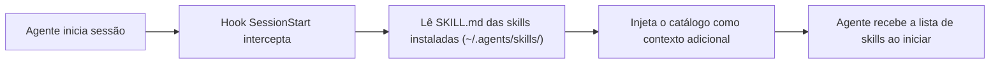

# Hooks — agents-skills

## Escopo

Hooks de sessão que injetam o catálogo de skills instaladas no início de cada sessão do agente.

Cada subdiretório contém os artefatos específicos de uma IDE/agente:

- **[`devin/`](devin/)** — Shell hook de session-start
- **[`claude/`](claude/)** — Shell hook (`SessionStart`) + `hooks.json`
- **[`cursor/`](cursor/)** — Shell hook (`sessionStart`) + `hooks.json`
- **[`windsurf/`](windsurf/)** — Shell hook (`sessionStart`) + `hooks.json`
- **[`vscode/`](vscode/)** — Shell hook (`sessionStart`) + `hooks.json` (formato Copilot)
- **[`gemini/`](gemini/)** — Shell hook de session-start

A lógica comum vive em [`session-start-base.sh`](session-start-base.sh), que é "sourced" pelos hooks por IDE.

## Como funciona



## Instalação

```bash
./install.sh --all     # Instala hooks para todas as IDEs suportadas
./install.sh --claude  # Instala hooks apenas para Claude Code
./install.sh --devin   # Instala hooks apenas para Devin
```

O `install.sh` copia os hooks do subdiretório correspondente para o diretório de configuração de cada IDE.

## Agentes suportados

| Agente | Mecanismo | Session Hook |
|--------|-----------|--------------|
| Devin | Shell hook | Sim |
| Claude Code | Shell hook (`SessionStart`) | Sim |
| Cursor | Shell hook (`sessionStart`) | Sim |
| Windsurf | Shell hook (`sessionStart`) | Sim |
| VS Code / Copilot | Shell hook (`sessionStart`) | Sim |
| Gemini CLI | Shell hook | Sim |
