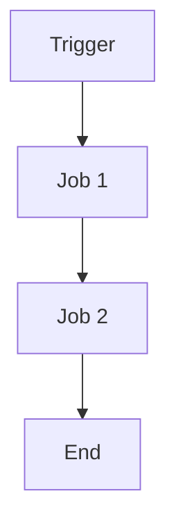

# Implementation Patterns Repository

This document contains implementation patterns and best practices identified from analyzing the skills and rules repository.

## Planning and Specification Patterns

### Implementation Plan Structure
All implementation plans should follow this standardized structure:

```markdown
---
goal: [Concise, actionable title]
version: [semantic version]
date_created: [YYYY-MM-DD]
last_updated: [YYYY-MM-DD]
owner: [responsible team/person]
status: [Completed|In progress|Planned|Deprecated|On Hold]
tags: [feature, upgrade, chore, architecture, migration, bug]
---

# Introduction


[Brief introduction explaining the plan's purpose]

## 1. Requirements & Constraints
- **REQ-001**: [Functional requirement]
- **SEC-001**: [Security requirement]
- **CON-001**: [Technical constraint]
- **GUD-001**: [Guideline to follow]
- **PAT-001**: [Pattern to implement]

## 2. Implementation Steps
### Phase 1: [Phase Name]
- GOAL-001: [Specific phase goal]

| Task | Description | Completed | Date |
|------|-------------|-----------|------|
| TASK-001 | [Specific, actionable task] | ✅ | 2025-01-01 |
| TASK-002 | [Another task] | | |

## 3. Alternatives
- **ALT-001**: [Alternative approach considered]
- **ALT-002**: [Why it wasn't chosen]

## 4. Dependencies
- **DEP-001**: [Library/framework dependency]
- **DEP-002**: [External system dependency]

## 5. Files
- **FILE-001**: [File path and purpose]
- **FILE-002**: [Another file]

## 6. Testing
- **TEST-001**: [Test case description]
- **TEST-002**: [Another test case]

## 7. Risks & Assumptions
- **RISK-001**: [Potential risk]
- **ASSUMPTION-001**: [Underlying assumption]

## 8. Related Specifications
[Links to related documentation]
```

### Specification Template for Workflows
For CI/CD workflows and processes:

```markdown
---
title: [Process Name] Specification
version: 1.0
date_created: [YYYY-MM-DD]
last_updated: [YYYY-MM-DD]
owner: [Team]
tags: [process, cicd, automation, domain-specific]
---

## Workflow Overview
**Purpose**: [One sentence description]
**Trigger Events**: [List triggers]
**Target Environments**: [Environment scope]

## Execution Flow Diagram


## Requirements Matrix
### Functional Requirements
| ID | Requirement | Priority | Acceptance Criteria |
|----|-------------|----------|-------------------|
| REQ-001 | [Requirement] | High | [Testable criteria] |

### Security Requirements
| ID | Requirement | Implementation Constraint |
|----|-------------|---------------------------|
| SEC-001 | [Security requirement] | [Constraint description] |

## Input/Output Contracts
### Inputs
```yaml
ENV_VAR_1: string  # Purpose
ENV_VAR_2: secret  # Purpose
```

### Outputs
```yaml
job_output: string  # Description
```

## Quality Gates
| Gate | Criteria | Bypass Conditions |
|------|----------|-------------------|
| Code Quality | [Standards] | [When allowed] |
| Security Scan | [Thresholds] | [When allowed] |
```

## Code Implementation Patterns

### Async/Await Patterns

#### C# Async Pattern
```csharp
// Good: Proper async method with cancellation token
public async Task<Result> ProcessDataAsync(CancellationToken cancellationToken = default)
{
    try
    {
        var data = await _repository.GetDataAsync(cancellationToken);
        var result = await _processor.TransformAsync(data, cancellationToken);
        return result;
    }
    catch (Exception ex)
    {
        _logger.LogError(ex, "Failed to process data");
        throw;
    }
}

// Bad: Blocking async code
public Result ProcessData()
{
    var data = _repository.GetDataAsync().Result; // Don't do this!
    return _processor.TransformAsync(data).Result;
}
```

#### JavaScript/TypeScript Async Pattern
```typescript
// Good: Proper async/await with error handling
async function processData(): Promise<Result> {
  try {
    const data = await repository.getData();
    const result = await processor.transform(data);
    return result;
  } catch (error) {
    logger.error('Failed to process data', error);
    throw error;
  }
}

// Bad: Promise chaining without proper error handling
function processData(): Promise<Result> {
  return repository.getData()
    .then(data => processor.transform(data))
    .catch(error => {
      // Silent error handling
      console.log(error);
    });
}
```

### Error Handling Patterns

#### Structured Error Handling
```csharp
// C# pattern with custom exceptions
public class DomainException : Exception
{
    public string ErrorCode { get; }
    public Dictionary<string, object> Context { get; }

    public DomainException(string errorCode, string message, Dictionary<string, object> context = null)
        : base(message)
    {
        ErrorCode = errorCode;
        Context = context ?? new Dictionary<string, object>();
    }
}

// Usage
try
{
    await _service.ProcessOrderAsync(order);
}
catch (DomainException ex) when (ex.ErrorCode == "ORDER_NOT_FOUND")
{
    return NotFound($"Order {order.Id} not found");
}
catch (DomainException ex)
{
    return BadRequest(ex.Message);
}
```

#### Global Exception Handling
```csharp
// ASP.NET Core middleware
public class GlobalExceptionHandlerMiddleware
{
    public async Task InvokeAsync(HttpContext context, RequestDelegate next)
    {
        try
        {
            await next(context);
        }
        catch (Exception ex)
        {
            await HandleExceptionAsync(context, ex);
        }
    }

    private static async Task HandleExceptionAsync(HttpContext context, Exception exception)
    {
        context.Response.StatusCode = exception switch
        {
            DomainException => 400,
            NotFoundException => 404,
            UnauthorizedException => 401,
            _ => 500
        };

        var response = new
        {
            error = exception.Message,
            correlationId = context.TraceIdentifier
        };

        await context.Response.WriteAsJsonAsync(response);
    }
}
```

### Data Access Patterns

#### Repository Pattern with DDD
```csharp
// Domain layer - Interface definition
public interface IOrderRepository
{
    Task<Order> GetByIdAsync(OrderId id, CancellationToken cancellationToken = default);
    Task<IReadOnlyList<Order>> GetByCustomerAsync(CustomerId customerId, CancellationToken cancellationToken = default);
    Task<Order> AddAsync(Order order, CancellationToken cancellationToken = default);
    Task UpdateAsync(Order order, CancellationToken cancellationToken = default);
    Task DeleteAsync(OrderId id, CancellationToken cancellationToken = default);
}

// Infrastructure layer - Implementation
public class OrderRepository : IOrderRepository
{
    private readonly DbContext _context;

    public async Task<Order> GetByIdAsync(OrderId id, CancellationToken cancellationToken = default)
    {
        var order = await _context.Orders
            .Include(o => o.Items)
            .FirstOrDefaultAsync(o => o.Id == id, cancellationToken);
        
        return order ?? throw new NotFoundException($"Order {id} not found");
    }
}
```

#### CQRS Pattern
```csharp
// Command side
public class CreateOrderCommandHandler : IRequestHandler<CreateOrderCommand, OrderId>
{
    public async Task<OrderId> Handle(CreateOrderCommand request, CancellationToken cancellationToken)
    {
        var order = Order.Create(request.CustomerId, request.Items);
        await _repository.AddAsync(order, cancellationToken);
        await _unitOfWork.SaveChangesAsync(cancellationToken);
        
        return order.Id;
    }
}

// Query side
public class GetOrderQueryHandler : IRequestHandler<GetOrderQuery, OrderDto>
{
    public async Task<OrderDto> Handle(GetOrderQuery request, CancellationToken cancellationToken)
    {
        var order = await _repository.GetByIdAsync(request.OrderId, cancellationToken);
        return _mapper.Map<OrderDto>(order);
    }
}
```

### Testing Patterns

#### Unit Test Structure
```csharp
public class OrderServiceTests
{
    [Fact(DisplayName = "CreateOrder_WithValidData_ReturnsOrderId")]
    public async Task CreateOrder_WithValidData_ReturnsOrderId()
    {
        // Arrange
        var command = new CreateOrderCommand
        {
            CustomerId = Guid.NewGuid(),
            Items = new List<OrderItemDto>
            {
                new() { ProductId = Guid.NewGuid(), Quantity = 2, Price = 10.99m }
            }
        };
        
        var handler = new CreateOrderCommandHandler(_repository, _unitOfWork);

        // Act
        var result = await handler.Handle(command, CancellationToken.None);

        // Assert
        Assert.NotNull(result);
        Assert.NotEqual(Guid.Empty, result);
        
        _repository.Verify(r => r.AddAsync(It.IsAny<Order>(), It.IsAny<CancellationToken>()), Times.Once);
        _unitOfWork.Verify(u => u.SaveChangesAsync(It.IsAny<CancellationToken>()), Times.Once);
    }
}
```

#### Integration Test Pattern
```csharp
public class OrderApiTests : IClassFixture<TestWebApplicationFactory<Program>>
{
    private readonly HttpClient _client;

    [Fact]
    public async Task CreateOrder_WithValidRequest_ReturnsCreated()
    {
        // Arrange
        var request = new CreateOrderRequest
        {
            CustomerId = Guid.NewGuid(),
            Items = new List<OrderItemRequest>
            {
                new() { ProductId = Guid.NewGuid(), Quantity = 2, Price = 10.99m }
            }
        };

        // Act
        var response = await _client.PostAsJsonAsync("/api/orders", request);

        // Assert
        response.StatusCode.Should().Be(HttpStatusCode.Created);
        
        var createdOrder = await response.Content.ReadFromJsonAsync<OrderResponse>();
        createdOrder.Should().NotBeNull();
        createdOrder.Id.Should().NotBeEmpty();
    }
}
```

### Configuration Patterns

#### Settings Pattern
```csharp
// Settings classes
public class DatabaseSettings
{
    public string ConnectionString { get; set; }
    public int MaxPoolSize { get; set; } = 100;
    public int CommandTimeout { get; set; } = 30;
}

public class ApiSettings
{
    public string BaseUrl { get; set; }
    public string ApiKey { get; set; }
    public TimeSpan Timeout { get; set; } = TimeSpan.FromSeconds(30);
}

// Registration
builder.Services.Configure<DatabaseSettings>(
    builder.Configuration.GetSection("Database"));

builder.Services.Configure<ApiSettings>(
    builder.Configuration.GetSection("Api"));
```

#### Dependency Injection Patterns
```csharp
// Scoped services (per request)
builder.Services.AddScoped<IOrderRepository, OrderRepository>();
builder.Services.AddScoped<IOrderService, OrderService>();

// Singleton services (application lifetime)
builder.Services.AddSingleton<ICacheService, RedisCacheService>();
builder.Services.AddSingleton<IEventBus, RabbitMqEventBus>();

// Transient services (always new)
builder.Services.AddTransient<IEmailService, SmtpEmailService>();
```

### API Design Patterns

#### RESTful API Structure
```csharp
[ApiController]
[Route("api/v1/[controller]")]
public class OrdersController : ControllerBase
{
    [HttpGet("{id:guid}")]
    [ProducesResponseType(typeof(OrderDto), StatusCodes.Status200OK)]
    [ProducesResponseType(StatusCodes.Status404NotFound)]
    public async Task<ActionResult<OrderDto>> GetOrder(Guid id)
    {
        var order = await _service.GetByIdAsync(id);
        return Ok(order);
    }

    [HttpPost]
    [ProducesResponseType(typeof(OrderDto), StatusCodes.Status201Created)]
    [ProducesResponseType(StatusCodes.Status400BadRequest)]
    public async Task<ActionResult<OrderDto>> CreateOrder(CreateOrderRequest request)
    {
        var order = await _service.CreateAsync(request);
        return CreatedAtAction(nameof(GetOrder), new { id = order.Id }, order);
    }
}
```

#### Minimal API Pattern
```csharp
// Program.cs
app.MapGet("/api/v1/orders/{id:guid}", async (Guid id, IOrderService service) =>
{
    var order = await service.GetByIdAsync(id);
    return order is null ? Results.NotFound() : Results.Ok(order);
})
.WithName("GetOrder")
.WithOpenApi();

app.MapPost("/api/v1/orders", async (CreateOrderRequest request, IOrderService service) =>
{
    var order = await service.CreateAsync(request);
    return Results.Created($"/api/v1/orders/{order.Id}", order);
})
.WithName("CreateOrder")
.WithOpenApi();
```

## Security Implementation Patterns

### Authentication Patterns
```csharp
// JWT Bearer Authentication
builder.Services.AddAuthentication(JwtBearerDefaults.AuthenticationScheme)
    .AddJwtBearer(options =>
    {
        options.TokenValidationParameters = new TokenValidationParameters
        {
            ValidateIssuer = true,
            ValidateAudience = true,
            ValidateLifetime = true,
            ValidateIssuerSigningKey = true,
            ValidIssuer = builder.Configuration["Jwt:Issuer"],
            ValidAudience = builder.Configuration["Jwt:Audience"],
            IssuerSigningKey = new SymmetricSecurityKey(
                Encoding.UTF8.GetBytes(builder.Configuration["Jwt:Key"]))
        };
    });
```

### Authorization Patterns
```csharp
// Policy-based authorization
builder.Services.AddAuthorization(options =>
{
    options.AddPolicy("CanManageOrders", policy =>
        policy.RequireClaim("permission", "orders:manage"));
});

// Usage
[Authorize(Policy = "CanManageOrders")]
public class OrderManagementController : ControllerBase
{
    // Controller actions
}
```

This repository of implementation patterns provides standardized approaches for common development tasks across the codebase.
