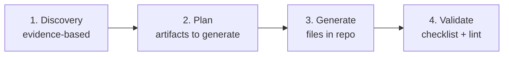

# Create Agent Harness

Generate a production-ready harness for AI agents (**Claude Code** and **Devin CLI** only) in a target repository. The harness is everything the model can't do alone.

> Escopo desta skill: **somente** Claude Code e Devin CLI. Não gere artefatos para Windsurf, Cursor, Gemini CLI, GitHub Copilot ou JetBrains AI — esses agentes estão fora do escopo.

## Core Principle

`Agent = Model + Harness`

Every harness component exists because the model can't do something on its own. Design for obsolescence — components become unnecessary as models improve. Two reliability loops guide the design:

- **Feedforward** — orient BEFORE acting (CLAUDE.md, rules, skills)
- **Feedback** — validate AFTER action (lint, tests, CI)

## Workflow



> ❗ **Forbidden:** invent context. Everything must be evidenced by the target repository.

## Step 1 — Discovery

Explore the target repo and document what exists:

| Discovery item | What to capture |
|---|---|
| Directory structure | Root + main subdirectories |
| Tech stack | Languages, frameworks, runtimes with versions |
| Architectural patterns | Clean Architecture, MVVM, microservices, etc. |
| External integrations | APIs, cloud services, auth providers |
| CI/CD pipelines | GitHub Actions, Jenkins, IUPipes, etc. |
| Code conventions | Naming, formatting, testing patterns |
| Existing agent infra | `CLAUDE.md`, `.claude/`, `.devin/`, `skills/`, `rules/`, `.instructions.md` |
| Ignore files | `.gitignore`, `.aiignore`, `.claudeignore`, etc. |

**Output discovery summary** (mandatory before generating anything):

```text
## Discovery Summary
- Stack: [languages and frameworks found]
- Architecture: [patterns identified]
- CI/CD: [pipelines found]
- Existing harness: [files already present]
- Conventions: [naming, testing, branching]
- Gaps: [what's missing for a complete harness]
```

Wait for confirmation before Step 2.

## Step 2 — Artifacts to Generate

Generate only what is missing or needs restructuring. Adapt structure to discovery findings.

### A. `CLAUDE.md` — Single Source of Truth (root)

**Limit:** max 500 lines. Single point of truth for Claude Code (and Devin CLI, which reads it natively).

```markdown
# CLAUDE.md

## Mission
[Project description + agent persona]

## Tech Stack
[Languages, frameworks, versions]

## Paths per Platform
| Platform | Skills | Rules | Knowledge |
|---|---|---|---|
| Claude Code | `.claude/skills/` | `.claude/rules/` | `.claude/knowledge/` |
| Devin CLI | `.claude/skills/` | `.claude/rules/` | `.claude/knowledge/` |

## Code Standards
- DO / DON'T / Principles (discovered from repo)

## Hard Rules
[Blocking restrictions — protected branches, immutable files, forbidden secrets]

## Soft Rules
[Warning + confirmation — modify Dockerfile, delete files, prod deploy]

## Agent Loop
[Choose pattern — ReAct / Plan-and-Execute / Reasoning Sandwich]

## Response Style
[Format, language, verbosity]

## References
- [docs/](../docs/) — System documentation (technologies, packages, plugins, features)
- [.claude/rules/](.claude/rules/) — Guardrails and permissions
- [.claude/skills/](.claude/skills/) — Agent skills
```

**Principles:**
- Context router — reference other files, don't duplicate
- Repo-specific — nothing generic
- Hard rules must be computationally verifiable (not just prompts)

### B. Platform Files (root)

| File | Platform | Content |
|---|---|---|
| `CLAUDE.md` | Claude Code + Devin CLI | Single Source of Truth (base instructions) |

**Rule:** `CLAUDE.md` is the main file — both Claude Code and Devin CLI read it natively.

> ⚠️ **DO NOT create `AGENTS.md` separately** — Devin CLI reads `CLAUDE.md` natively. Creating a separate file is unnecessary duplication.
> ⚠️ **DO NOT create platform files for Windsurf, Cursor (`.cursorrules`), Gemini (`GEMINI.md`), Copilot (`copilot-instructions.md`) or JetBrains** — these platforms are outside the scope of this skill.

### C. `.claude/CONTEXT.md` — Context Engineering

Defines how context is delivered to the agent.

| Strategy | When | Examples |
|---|---|---|
| **Always-on** | Always loaded | CLAUDE.md, hard rules |
| **Pattern-matched** | By file type | `applyTo: '**/*.cs'` → C# rules |
| **On-demand** | When requested | Knowledge, design docs |
| **Progressive disclosure** | Large codebases | Dir map → headers → content |

**Must include:**
- Loading priority hierarchy
- Token budget (reserve 20% for output)
- Chunking strategy (files >500 lines)
- Context compaction: budget reduction → snip → microcompact → collapse → auto-compact

### D. `.claude/RULES.md` — Guardrails

> Principle: prefer computational controls over prompts. Lint and CI cannot be ignored; prompts can.

```markdown
# RULES.md

## Hard Rules (immediate block)
[Protected branches, immutable workflows, etc.]

## Soft Rules (warning + confirmation)
[Modify Dockerfile, prod deploy, delete files]

## Per-Environment Permissions
[dev/staging/prod — adapted to what exists]

## Tool Permissions
- Read-only by default
- Write via approval gates
- Execute in sandbox with logging
```

### E. `.claude/MEMORY.md` — State Management

> ❗ Never store PII, secrets, or credentials.
> ❗ Verify just-in-time against current code before using cross-session memory.

```markdown
# MEMORY.md

## Technical Decisions
| Date | Decision | Rationale | Alternatives Discarded |

## Technical Debt
| Item | Impact | Priority |

## Lessons Learned
| Context | Mistake | How to Avoid |

## Cleanup Policies
- Memories from deleted branches must be discarded
- Outdated facts must be removed
```

**Three memory tiers:**

| Tier | Persistence | Content | Implementation |
|---|---|---|---|
| **Procedural** | Always loaded | How to work | CLAUDE.md, rules |
| **Semantic** | On demand | Facts, patterns | knowledge/, docs |
| **Episodic** | Cross-session | Experiences | MEMORY.md |

### F. `.claude/TOOLS.md` — Tools and MCP

**Tool design principles:** named for what they do (not how), minimal schemas, JSON errors, idempotent operations.

| Category | Risk | Policy |
|---|---|---|
| **Read-only** (search, list) | Low | Free |
| **Write** (edit, create, delete) | Medium | Confirmation |
| **Execute** (run, build, deploy) | High | Sandboxed + logged |
| **External** (APIs, webhooks) | Variable | Rate-limited |

Include: available tools, MCP servers, external APIs (required headers, timeouts, rate limits).

### G. `.claude/WORKFLOWS.md` — Automation

Document discovered or recommended workflows:

- Preconditions and success criteria per workflow
- Trigger conditions (issue opened, PR created, schedule)
- Verification loop: `Agent Output → Lint → Tests → CI → LLM Judge → Human`
- Rollback strategy

If repo uses GitHub Actions, consider **gh-aw** (Agentic Workflows) with safe-outputs, sanitized context expressions, and bash narrowlist tool allow-listing. See `github-agentic-workflows` skill.

### H. Ignore Files

> ❗ **`.claudeignore` and `.devinignore` are NOT read by CLIs.** Claude Code and Devin CLI exclude files via **`permissions.deny`** (default `Read(...)` patterns) and respect `.gitignore` for discovery. Do not generate dedicated ignore files.

**Correct mechanism by platform:**

| Platform | Where | How |
|---|---|---|
| **Claude Code** | `.claude/settings.json` | `permissions.deny` with `Read(...)` patterns (deprecated `ignorePatterns`) |
| **Devin CLI** | `.devin/config.json` | `permissions.deny` (`Read(...)`/`Exec(...)`) |

> Files matching `deny` patterns are excluded from discovery, search, and reading. `.gitignore` is respected for file discovery.

**Base content** (adapt to discovered stack):

```gitignore
# Build outputs
bin/  obj/  dist/  build/  out/

# Dependencies
node_modules/  .venv/  __pycache__/

# Version control
.git/

# Secrets
.env  .env.*  *.key  *.pem  secrets.*

# IDE
.vs/  .idea/

# Test artifacts
TestResults/  coverage/

# Logs
*.log  logs/
```

### I. `.claude/skills/{name}/SKILL.md` — Agent Skills

```yaml
---
name: skill-name
description: >
  [What]. Use when [triggers, contexts].
  Do NOT use for [anti-patterns] (use alternative-skill).
metadata:
  version: "1.0.0"
---

## Context
## Behavior
## Restrictions
## Examples
```

**Principles:** Single Responsibility, modular (no implicit dependencies), self-contained.

### J. `.claude/rules/{domain}.md` — Rules per Domain

One rule per stack domain with contextual activation via `paths:` (native Claude Code frontmatter, also read by Devin CLI):

```markdown
---
paths:
  - "**/*.cs"
  - "**/*.csproj"
---

# Rule content
```

> **Important:** `applyTo` is NOT interpreted by Claude Code or Devin CLI. For path-scoped activation use `paths:` in `.claude/rules/`. Rules **without** `paths:` are always-on.

### K. `.claude/README.md` — Infrastructure Documentation

- File structure diagram
- How skills are loaded (tripartite description)
- How to add a new skill (step by step)
- Platform compatibility table
- How to run verification loop locally

### L. `docs/` — System Documentation

> **Create `docs/` folder at repository root** to document the system for both LLMs and human developers.

**Purpose:** Provide comprehensive system documentation to help LLMs understand the system architecture, technologies, and functionality.

**Required documentation files:**

```markdown
docs/
├── README.md              # System overview and architecture
├── technologies.md        # Technologies, frameworks, versions
├── packages.md            # NPM packages, NuGet packages, dependencies
├── plugins.md             # Plugins, extensions, integrations
├── features.md            # System features and functionality
└── api.md                 # API documentation (if applicable)
```

**Content guidelines:**

- **Neutral language** — suitable for both LLMs and human developers
- **Evidence-based** — document what actually exists in the repository
- **Structured format** — use tables, lists, and code blocks for clarity
- **Always updated** — LLMs must consult and update this documentation when making changes

**`docs/README.md` template:**

```markdown
# System Documentation

## Overview
[System description, purpose, and scope]

## Architecture
[High-level architecture, modules, components]

## Directory Structure
[Key directories and their purposes]

## Quick Start
[How to set up and run the system]

## References
- [technologies.md](./technologies.md) — Technologies and versions
- [packages.md](./packages.md) — Dependencies and packages
- [plugins.md](./plugins.md) — Plugins and integrations
- [features.md](./features.md) — System features
```

**Rule:** When an LLM makes changes to the codebase, it must:
1. Consult the relevant `docs/` files before implementing changes
2. Update the `docs/` files after implementing changes to keep documentation current

### M. `.claude/agents/` — Sub-Agents (OBRIGATÓRIO)

> **OBRIGATÓRIO.** Criar sempre três sub-agentes especializados: **Review**, **Plan** e **Test**, em `.claude/agents/{nome}.md`. Cada sub-agent deve ser especializado de acordo com a stack e convenções do repositório analisado.

> **Estrutura unificada:** Claude Code **e** Devin CLI compartilham a **mesma pasta e o mesmo formato** de sub-agent (`.claude/agents/`). Não há tradução por plataforma nem duplicação — um único arquivo por sub-agent serve aos dois.

Sub-agents apply `Agent = Model + Harness` at finer granularity — reduced scope, isolated context, restricted permissions.

**Required sub-agents:**

| Sub-agent | Purpose | When to use |
|---|---|---|
| `review.md` | Review code, PRs, changes with focus on quality, patterns, security, performance | Proactively after changes, before commit |
| `plan.md` | Create detailed execution plans for complex tasks | Before multi-file changes, complex refactors, migrations |
| `test.md` | Generate and run tests, validate coverage | When implementing features or refactors |

**Frontmatter template:**

```yaml
---
name: review
description: >
  Use PROACTIVELY to review code and PRs. Aciona ao concluir mudanças,
  validar aderência a padrões e detectar problemas de qualidade, segurança
  e performance. Especializado na stack do repositório.
tools: Read, Grep, Glob
model: inherit
---

## Missão
[Review mission specific to the repo's stack]
```

**Design principles:** Single Responsibility, Context Isolation, Structured I/O, Tool Minimization, Bounded Execution, internal Feedforward/Feedback loops.

### N. `.devin/config.json` — Devin CLI Configuration (OBRIGATÓRIO)

> **OBRIGATÓRIO.** Criar sempre o arquivo `.devin/config.json` para habilitar o Devin CLI a ler a configuração do Claude Code.

```jsonc
{
  // Importação de configs do Claude Code (OBRIGATÓRIO)
  "read_config_from": {
    "claude": true
  },
  "permissions": {
    "deny": [
      "Read(./.env)",
      "Read(**/*.key)",
      "Read(**/*.pem)",
      "Read(./.github/workflows/**)"
    ]
  },
  "hooks": {
    // bloquear push para branches protegidas (glob não parseia branch)
    "PreToolUse": [
      { "matcher": "Exec", "command": "bash .devin/hooks/block-protected-push.sh" }
    ]
  }
}
```

> ⚠️ **`read_config_from: { claude: true }` é OBRIGATÓRIO** — sem isso, o Devin CLI não importará as rules, skills e subagents do Claude Code.

## Step 3 — Agent Loop

Define in CLAUDE.md. Choose pattern adapted to the repo:

| Pattern | When to Use |
|---|---|
| **ReAct** (`Observe → Think → Act → Verify`) | Simple step-by-step tasks |
| **Plan-and-Execute** | Long-horizon, multi-file tasks |
| **Reasoning Sandwich** (`Deep Think → Execute → Deep Think → Verify`) | Complex tasks with critical verification |

**Plan-and-Execute expanded:**

```text
1. Receive task
2. Load CLAUDE.md + rules (always-on)
3. Load pattern-matched skills/rules
4. Present Execution Plan — wait for approval
5. Verify guardrails
6. Execute (sandbox + permissions)
7. Verification loop: lint → test → CI
8. Validate result
9. Adjust (max 2 iterations before escalating to human)
10. Update MEMORY.md
```

## Step 4 — Validation

### Anti-Patterns

| Anti-Pattern | Fix |
|---|---|
| Guardrails only in prompts | Add computational controls (permissions.deny, hooks) |
| Unlimited context | Compact and curate with budget |
| No verification loop | Mandatory lint/test/CI |
| Monolithic agent | Split into sub-agents if needed |
| Stateless sessions | MEMORY.md with checkpoints |
| Verbose feedback | Filter to summary lines |
| Duplicated info across files | Reference, don't copy |
| `AGENTS.md` created | Remove — Devin reads CLAUDE.md natively |
| `GEMINI.md` / `.cursorrules` / `.geminiignore` / `.cursorignore` / `.aiignore` / `.windsurfignore` criados | Remover — fora do escopo (Windsurf, Cursor, Gemini, JetBrains não são suportados aqui) |

### Quality Checklist

- [ ] `CLAUDE.md` ≤ 500 lines, no generic content
- [ ] Platform files reference CLAUDE.md — no duplication
- [ ] `permissions.deny` covers secrets and `/.github/workflows` (`.claude/settings.json` + `.devin/config.json`)
- [ ] Hook de branch protection (main/master/develop) configured nas duas plataformas
- [ ] Skills with tripartite description (What / Use when / Do NOT use)
- [ ] Rules in `.claude/rules/` with `paths:` for activation (NOT `applyTo`)
- [ ] Knowledge files are self-contained
- [ ] Verification loop documented and executable
- [ ] Interoperable across relevant platforms
- [ ] All artifacts consistent with each other
- [ ] No invented context — everything backed by repo evidence

## Output

When complete, list all generated artifacts grouped by location:

```text
## Generated Artifacts

### Root
- [ ] CLAUDE.md (SSoT, ≤500 lines) — lido por Claude Code e Devin CLI nativamente
- [ ] .claude/settings.json (permissões, hooks)
- [ ] .devin/config.json (read_config_from: { claude: true })

### docs/
- [ ] README.md — System overview and architecture
- [ ] technologies.md — Technologies, frameworks, versions
- [ ] packages.md — NPM packages, NuGet packages, dependencies
- [ ] plugins.md — Plugins, extensions, integrations
- [ ] features.md — System features and functionality
- [ ] api.md — API documentation (if applicable)

### .claude/
- [ ] settings.json (permissões, hooks)
- [ ] rules/global-rules.md (always-on)
- [ ] rules/{domain}.md (path-scoped com `paths:`)
- [ ] agents/review.md (sub-agent de revisão)
- [ ] agents/plan.md (sub-agent de planejamento)
- [ ] agents/test.md (sub-agent de testes)
- [ ] skills/{domain}/SKILL.md
- [ ] knowledge/{domain}.md (opcional)

### .devin/
- [ ] config.json (read_config_from: { claude: true })
- [ ] hooks/block-protected-push.sh (opcional, para branch protection)
```

## Additional Requirements

### Hard Rules (Bloqueio Imediato)

**Branches protegidas** — proibido push/commit direto:
- `main`
- `master`
- `develop`

**Workflows protegidos** — proibido modificar:
- `/.github/workflows`

### Estratégia de Branch (Obrigatória)

Toda alteração deve ocorrer em branch dedicada.

**Padrão de nomenclatura:**
```
feature/{AgentLLM}-{data-juliana}-{descricao-curta}
```

**Regras:**
- `data-juliana` = YYYYMMDD
- `descricao-curta` em inglês, kebab-case
- `AgentLLM` = nome do agent/LLM (devin, copilot, cursor)
- Branch baseada em `main` ou `master`

### Execution Plan (Obrigatório)

Antes de qualquer modificação, apresentar plano:

**Claude Code:** Use `/plan` antes de executar (ativa Plan Mode para multi-arquivo).
**Devin CLI:** Use sub-agent `.claude/agents/plan.md` para planejamento.

```
Execution Plan:
1. Goal and context
2. Impacted files and modules
3. Implementation strategy
4. Risks and mitigations
5. Validation steps (tests, build, lint)
```

### Multi-Agent

**Sempre que possível, use multi-agent:**
- Tarefas independentes → Dispatch agentes em paralelo (um por domínio)
- Revisão de código → Sub-agent reviewer com contexto isolado
- Planejamento complexo → Sub-agent planner antes de execução
- Testes → Sub-agent especializado em testes

## When to use related skills

| Need | Skill |
|---|---|
| Build an MCP server for the agent | `building-mcp-servers` |
| GitHub Actions agentic workflows (gh-aw) | `github-agentic-workflows` |
| Full Devin operational playbook with confirmation gates | `devin/playbooks/create-agents` |

## References

- [agents.md specification](https://agents.md/#examples)
- [OpenAI — Harness Engineering](https://openai.com/index/harness-engineering/)
- [Anthropic — Building Effective Agents](https://www.anthropic.com/research/building-effective-agents)
- [Claude Code — Memory & Imports](https://code.claude.com/docs/en/memory)
- [Claude Code — Subagents](https://code.claude.com/docs/en/sub-agents)
- [Claude Code — Settings & Permissions](https://code.claude.com/docs/en/settings)
- [Devin CLI — Extensibilidade](https://docs.devin.ai/pt-BR/cli/extensibility)
- [Martin Fowler — Harness Engineering](https://martinfowler.com/articles/exploring-gen-ai/harness-engineering.html)
- [LangChain — Anatomy of an Agent Harness](https://blog.langchain.com/the-anatomy-of-an-agent-harness/)
- [awesome-ai-conventions](https://github.com/GuilhermeAlbert/awesome-ai-conventions)
- [Agent Skills Specification](https://agentskills.io/specification)
- [Model Context Protocol](https://modelcontextprotocol.io/docs/getting-started/intro)
- [GitHub Agentic Workflows](https://github.com/github/gh-aw)
- [Awesome Harness Engineering](https://github.com/walkinglabs/awesome-harness-engineering)

> **Instrução para o LLM:** Consulte estas referências quando necessário para alinhar com as convenções da comunidade e fazer ajustes no repositório. Use-as como guia para melhores práticas de harness engineering e para manter-se atualizado com as evoluções das plataformas.
